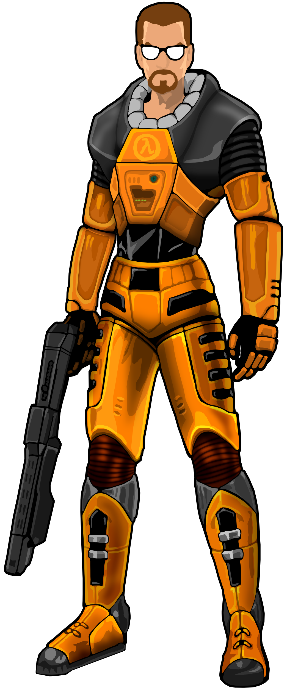

<!DOCTYPE html>
<html lang="en" dir="ltr">
  <head>
    <link rel="stylesheet" href="styles/halflife.css">
    <meta charset="utf-8">
    <title></title>
  </head>
  <body>
    <header>
      <h1>H'LF LIFE</h1>
      <h2>e seus "descendentes"</h2>
      <nav>
        <ul>
          <li><a href="HalfLife.html">H'LF LIFE</a></li>
          <li><a href="CounterStrike.html">Counter Strike</a></li>
          <li><a href="Portal.html">Portal</a></li>
          <li><a href="TeamFortress.html">Team Fortress</a></li>
          <li><a href="L4D.html">Left 4 Dead</a></li>
          <li><a href="autores.html">Autores</a></li>
        </ul>
      </nav>
    </header>
    
  </body>
</html>
